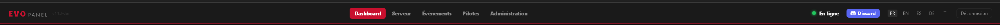
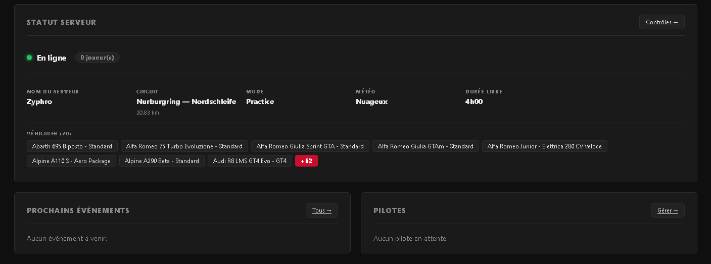
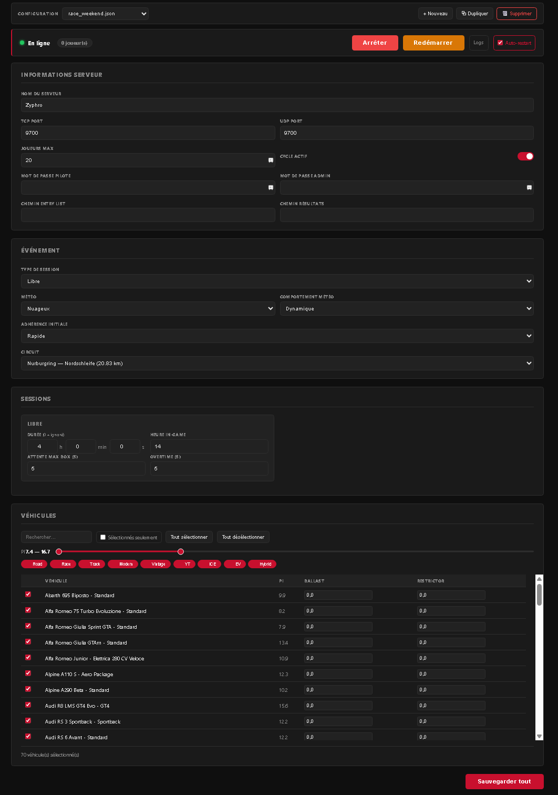
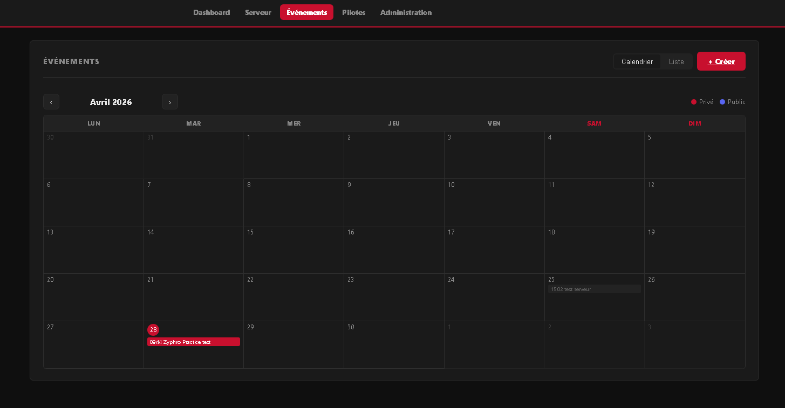
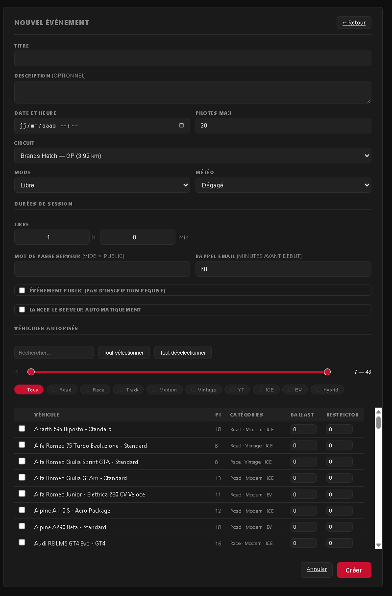

<p align="center">
  
</p>

<h1 align="center">AC EVO Server Panel</h1>

<p align="center">
  Interface web pour gérer un serveur dédié Assetto Corsa EVO sous Windows.<br>
  Déployable en local ou derrière un reverse proxy (Caddy, Nginx…).
</p>

<p align="center">
  <a href="#installation">Installation Windows</a> •
  <a href="#installation-docker-linux">Docker</a> •
  <a href="#configuration">Configuration</a> •
  <a href="#mise-à-jour">Mise à jour</a> •
  <a href="#changelog">Changelog</a> •
  <a href="https://ko-fi.com/zyphro3d">☕ Soutenir</a>
</p>

---

## Aperçu

### Dashboard public

Statut du serveur en temps réel, événement en cours et prochains à venir. Accessible sans compte.

<p align="center">
  
</p>

### Gestion du serveur

Démarrage, arrêt, restart depuis le navigateur. Circuit, météo, voitures avec filtres catégorie et plage PI, ballast et restrictor par voiture. Un seul bouton « Sauvegarder tout » en bas de page.

<p align="center">
  
</p>

### Calendrier des événements

Vue mensuelle avec chips colorés. Clic sur un jour → vue horaire 00h–23h. Clic sur un créneau vide → formulaire de création pré-rempli. Lancement automatique du serveur à l'heure prévue, passage en « terminé » 1h après la fin des sessions.

<p align="center">
  
</p>

### Formulaire de création d'événement

Circuit, mode, météo, durées de session, sélection des voitures avec ballast/restrictor, places max, mot de passe optionnel.

<p align="center">
  
</p>

---

## Fonctionnalités

**Serveur** — Modes Practice et Race Weekend (Practice + Qualif + Chauffe + Course). Auto-restart watchdog en cas de crash. Nombre de joueurs en temps réel via l'API HTTP du jeu. Logs serveur consultables depuis l'interface. Notifications Discord (démarrage, arrêt, crash).

**Pilotes** — Inscription publique avec validation. Approbation manuelle par l'admin. Inscriptions aux événements avec confirmation admin. Génération automatique de l'`entry_list.json` depuis les inscrits confirmés. Emails transactionnels (approbation, rejet, rappel avant départ).

**Événements** — Publics ou privés, brouillon/publié/terminé. Lancement auto du serveur à l'heure prévue. Rappels email configurables (X minutes avant le départ). Fin automatique après la dernière session + 1h de grâce.

**Calendrier** — Vue mensuelle avec chips colorés (rouge = privé, bleu = public ; brouillons désaturés, terminés grisés). Clic sur un jour → vue horaire détaillée avec blocs d'événements. Clic sur un créneau vide → formulaire de création pré-rempli à cette heure.

**Interface** — Multilingue (FR / EN / ES / DE / IT). Statut serveur rafraîchi toutes les 5s dans la navbar. Vue calendrier ou liste mémorisée entre les visites. Fuseau horaire configurable (`PANEL_TIMEZONE`) appliqué à la saisie et à l'affichage.

**Sécurité** — CSRF sur tous les formulaires. Rate limiting (login, inscription, reset password). Tokens de réinitialisation stockés en SHA-256. Headers HTTP durcis (CSP, HSTS, X-Frame-Options). Comparaison des identifiants en temps constant (anti timing-attack). Deux niveaux admin : `admin` et `superadmin`.

---

## Installation

### Prérequis

- **Python 3.11+** dans le PATH
- **Git** dans le PATH
- Les fichiers `cars.json`, `events_practice.json` et `events_race_weekend.json` générés par le **ServerLauncher officiel** d'Assetto Corsa EVO

### Étapes

```bat
git clone https://github.com/Zyphro3D/pannel-ac-evo-server.git
cd pannel-ac-evo-server
```

Lancer **`install.bat`** (double-clic ou terminal). Le script crée l'environnement virtuel, installe les dépendances et pose quelques questions pour générer le `.env` :

- Chemin d'installation du serveur ACE EVO
- Chemin du dossier de configurations
- Mots de passe admin et superadmin
- URL publique du panel

Puis démarrer :

```bat
start.bat
```

Le panel est accessible sur `http://localhost:4300` (port modifiable dans `.env`).

---

## Configuration

Le fichier `.env` contient toute la configuration. Les variables sont décrites ci-dessous.

### Général

| Variable | Description | Défaut |
|---|---|---|
| `SECRET_KEY` | Clé secrète Flask — **à changer en production** | — |
| `ADMIN_USERNAME` / `ADMIN_PASSWORD` | Compte admin standard | `admin` / `admin` |
| `SUPERADMIN_USERNAME` / `SUPERADMIN_PASSWORD` | Compte superadmin (ports réseau visibles) | `superadmin` / `superadmin` |
| `PANEL_URL` | URL publique du panel (utilisée dans les emails) | `http://localhost:4300` |
| `PANEL_TIMEZONE` | Fuseau horaire pour la saisie et l'affichage des dates | `Europe/Paris` |
| `DEFAULT_LOCALE` | Langue par défaut (`fr` / `en` / `es` / `de` / `it`) | `fr` |
| `SESSION_COOKIE_SECURE` | `true` derrière HTTPS, `false` en HTTP local | `true` |

### Serveur ACE

| Variable | Description | Défaut |
|---|---|---|
| `ACESERVER_DIR` | Dossier d'installation du serveur ACE EVO | `C:\aceserver` |
| `CONFIGS_DIR` | Dossier contenant vos `.json` de configuration | — |
| `ACESERVER_HTTP_PORT` | Port HTTP de l'API du jeu | `8080` |
| `SERVER_SHOW_CONSOLE` | Afficher la fenêtre console du serveur | `false` |
| `DATABASE_URL` | URL SQLAlchemy | `sqlite:///ace_evo.db` |

### Discord

| Variable | Description |
|---|---|
| `DISCORD_WEBHOOK_URL` | Webhook principal (démarrage / arrêt / crash) |
| `DISCORD_PILOTS_WEBHOOK_URL` | Webhook pilotes (inscriptions, rappels) — fallback sur le principal si vide |
| `DISCORD_INVITE_URL` | Lien d'invitation affiché dans la navbar — laisser vide pour masquer |

### Emails *(optionnel)*

| Variable | Description | Défaut |
|---|---|---|
| `MAIL_SERVER` | Serveur SMTP (ex : `smtp.gmail.com`) | — |
| `MAIL_PORT` | Port SMTP | `587` |
| `MAIL_USE_TLS` | STARTTLS | `true` |
| `MAIL_USERNAME` | Identifiant SMTP | — |
| `MAIL_PASSWORD` | Mot de passe SMTP | — |
| `MAIL_FROM` | Adresse expéditeur | — |
| `MAIL_ADMIN` | Adresse(s) admin pour les notifications (virgule pour séparer) | — |

> Si `MAIL_SERVER` est vide, aucun email n'est envoyé.

Générer une `SECRET_KEY` sécurisée :

```bat
.venv\Scripts\python -c "import secrets; print(secrets.token_hex(32))"
```

---

## Installation Docker (Linux)

Le panel et le serveur ACE EVO tournent dans un seul conteneur Docker (Python 3.11 + Wine).  
Télécharger le zip **Docker** depuis les [Releases GitHub](https://github.com/Zyphro3D/pannel-ac-evo-server/releases).

### Prérequis

- **Docker** et **Docker Compose** installés sur l'hôte Linux
- Les fichiers serveur ACE EVO (`AssettoCorsaEVOServer.exe`, `cars.json`, `events_practice.json`, `events_race_weekend.json`) fournis par le ServerLauncher officiel

### Étapes

```bash
cd docker/
cp .env.example .env
# Éditer .env (SECRET_KEY, mots de passe, PANEL_URL…)

# Copier les fichiers du serveur ACE EVO dans docker/aceserver/
# (AssettoCorsaEVOServer.exe, cars.json, events_*.json, content/, …)
mkdir -p aceserver/configs

docker compose up -d
```

Le panel est accessible sur `http://localhost:4300`.

Les logs du panel : `docker compose logs -f panel`

### Variables importantes en mode Docker

| Variable | Description | Défaut Docker |
|---|---|---|
| `DEPLOY_MODE` | `docker` activé automatiquement dans le conteneur | `docker` |
| `ACESERVER_EXE_PATH` | Chemin du .exe dans le conteneur | `/aceserver/AssettoCorsaEVOServer.exe` |
| `CONFIGS_DIR` | Dossier de configurations dans le conteneur | `/aceserver/configs` |
| `SESSION_COOKIE_SECURE` | `false` si accès HTTP, `true` derrière HTTPS | `false` |

> **Crédits Wine** : approche Docker inspirée de [VandaLpr/acevo-docker-server](https://github.com/VandaLpr/acevo-docker-server).

---

## Mise à jour

```bat
update.bat
```

Fait un `git pull`, met à jour les dépendances pip et recompile les traductions. Le `.env` et la base de données ne sont jamais modifiés. Les migrations de base s'appliquent automatiquement au démarrage. Fonctionne même en sautant plusieurs versions.

---

## Changelog

### v1.2.0 — 28/04/2026

**Nouveautés**
- Calendrier des événements : vue mensuelle avec chips colorés (privé/public/statut)
- Vue journée avec timeline horaire (00h–23h), clic sur un créneau → création pré-remplie
- Ballast et Restrictor par voiture dans les événements et le serveur
- Lancement automatique = publication automatique de l'événement
- Fin automatique des événements 1h après la durée prévue (sans action manuelle)
- Fuseau horaire appliqué à la saisie des dates (plus seulement à l'affichage)
- Affichage début → fin de chaque événement pour faciliter la planification
- Bouton Discord intégré directement dans la navbar
- Page serveur en défilement unique avec un seul bouton « Sauvegarder tout »
- Slider PI mémorisé entre les rechargements de page
- `update.bat` pour la mise à jour sans toucher au `.env` ni à la base

**Corrections**
- Checkboxes « Événement public » et « Lancement automatique » ignorées à l'édition (bug `form.get` vs `form.getlist`)
- Slider PI dans le formulaire d'événement non visible et sans auto-sélection (track div manquant)
- Statut serveur affichait le nom du fichier de config au lieu de « En ligne / Hors ligne »
- Badges de statut en anglais dans les listes d'événements

---

### v1.1.0

**Nouveautés**
- Protection CSRF sur tous les formulaires HTML (Flask-WTF)
- Rate limiting sur le login, l'inscription et le reset password (Flask-Limiter)
- Tokens de réinitialisation de mot de passe stockés en SHA-256
- Headers de sécurité HTTP durcis (CSP, HSTS, X-Frame-Options…)
- Support multilingue FR / EN / ES / DE / IT
- Notifications Discord pilotes sur webhook séparé
- Bannière Discord configurable (`DISCORD_INVITE_URL`)

---

## Soutenir le projet

[](https://ko-fi.com/zyphro3d)

---

## Licence

[CC BY-NC 4.0](LICENSE) — Usage personnel et communautaire libre, usage commercial interdit.
