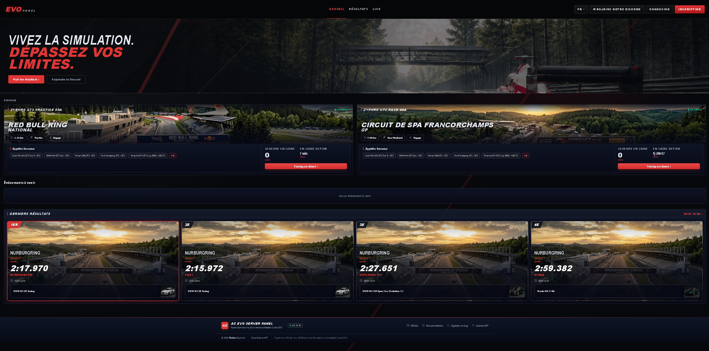
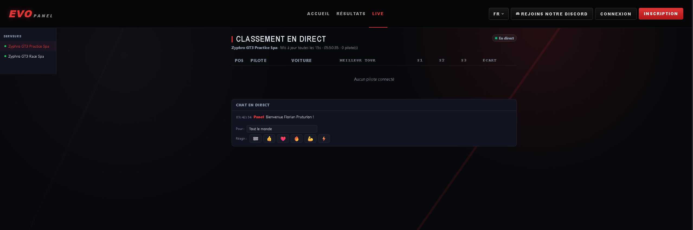
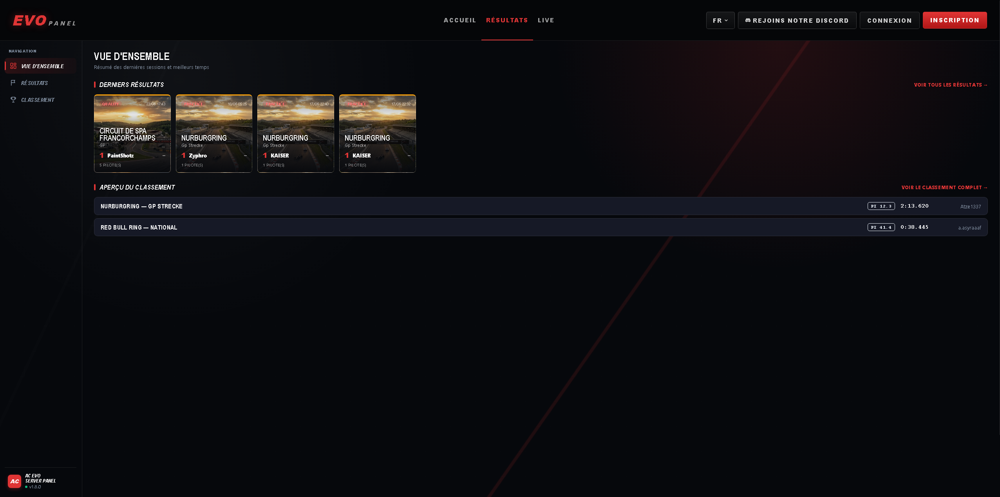
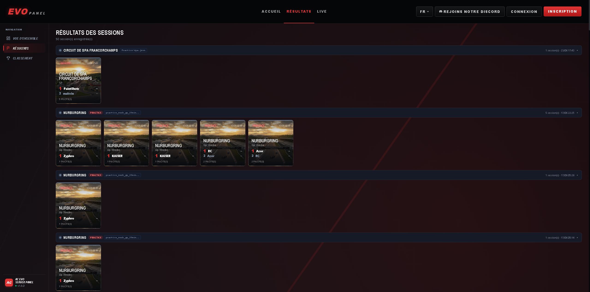
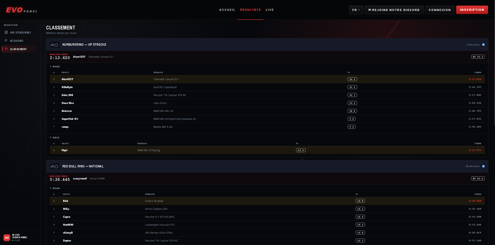
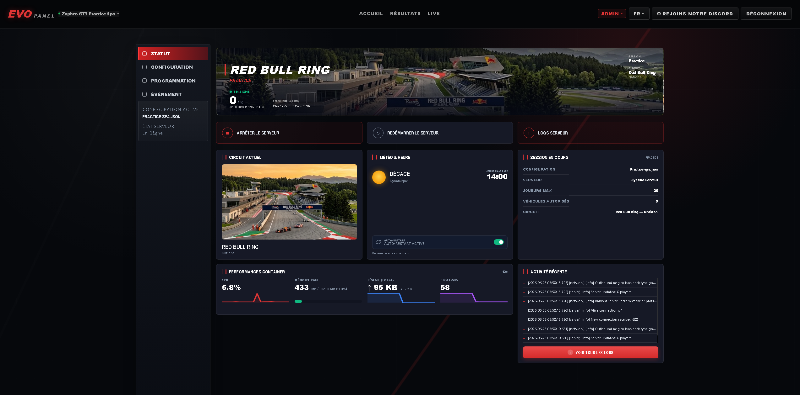
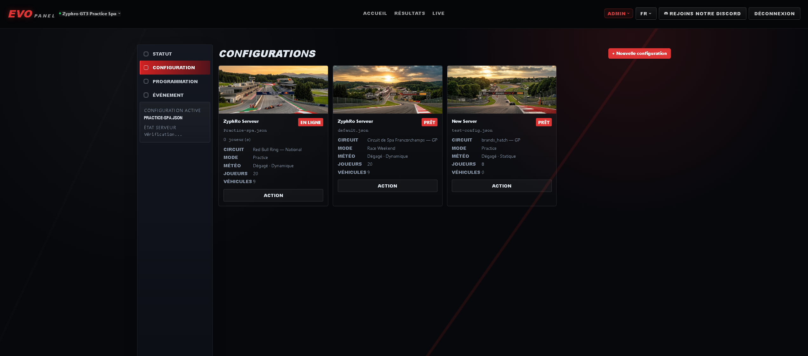
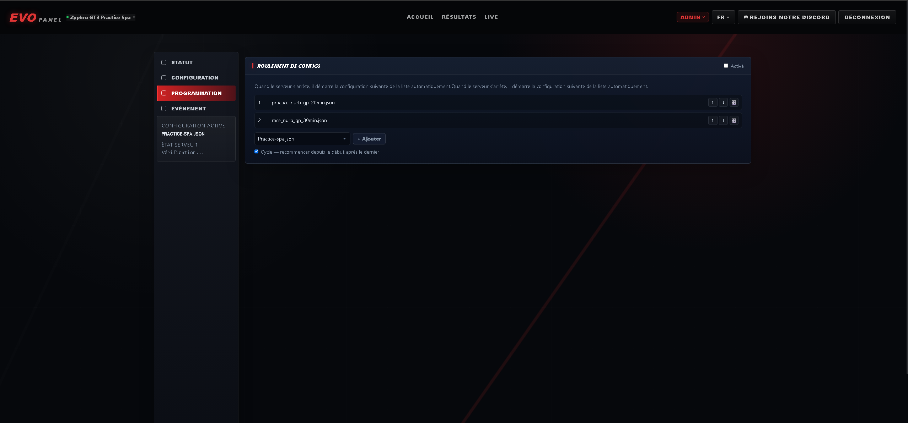
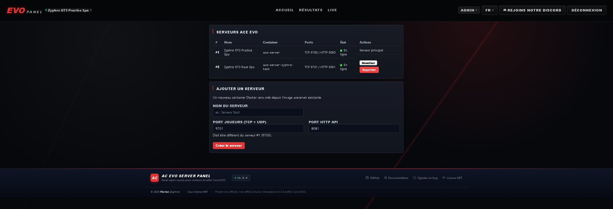

<p align="center">
  
</p>

<h1 align="center">AC EVO Server Panel</h1>

<p align="center">
  Interface web pour gérer un ou plusieurs serveurs dédiés Assetto Corsa EVO.<br>
  <strong>Déploiement Docker (Linux) — panel et serveur dans des containers séparés.</strong>
</p>

<p align="center">
  <a href="#-installation-docker-linux">🐧 Installation</a> •
  <a href="#configuration">Configuration</a> •
  <a href="#mise-à-jour">Mise à jour</a> •
  <a href="#changelog">Changelog</a> •
  <a href="https://ko-fi.com/zyphro3d">☕ Soutenir</a>
</p>

---

<p align="center">
  <strong>Ce projet est gratuit et open source.</strong><br>
  Si le panel tourne sur votre serveur et vous fait gagner du temps, un café est toujours apprécié ☕<br>
  Chaque soutien encourage le développement de nouvelles fonctionnalités.
</p>

<p align="center">
  <a href="https://ko-fi.com/zyphro3d"></a>
</p>

---

## Aperçu

<table>
  <tr>
    <td></td>
    <td></td>
  </tr>
  <tr>
    <td></td>
    <td></td>
  </tr>
  <tr>
    <td></td>
    <td></td>
  </tr>
  <tr>
    <td></td>
    <td></td>
  </tr>
  <tr>
    <td colspan="2"></td>
  </tr>
</table>

---

## Fonctionnalités

**Serveur de jeu**
- Démarrage, arrêt et restart depuis l'interface — pas d'accès SSH nécessaire
- Auto-restart watchdog (relance automatique en cas de crash)
- Statut en temps réel : joueurs connectés, uptime, métriques CPU/RAM du container, logs en direct
- Support multi-serveurs : chaque serveur ACE EVO tourne dans son propre container Docker
- Création de serveurs supplémentaires depuis le panel (superadmin)
- Sélecteur de serveur actif dans la navbar

**Configuration**
- Éditeur de config JSON complet : circuit, météo, sessions (Practice / Qualifying / Warmup / Race), voitures
- Banque de véhicules (94 voitures, catégories Road/Race/Track, filtres, images)
- Banque de circuits (36 circuits avec layout et longueur, images)
- Roulement de configs avec file d'attente et glisser-déposer, option cycle

**Événements**
- Calendrier mensuel avec création/édition d'événements (publics ou privés)
- Lancement automatique du serveur à l'heure prévue, arrêt après la dernière session
- Inscriptions pilotes avec validation manuelle et génération de l'`entry_list.json`
- Emails transactionnels (approbation, rejet, rappel)

**Live & Résultats**
- Timing en direct mis à jour toutes les 15 secondes via le bot TCP du serveur
- Tours invalides signalés en temps réel (track limits, split manqué)
- Import automatique des résultats en fin de session (webhook)
- Classement détaillé : drapeaux, meilleurs tours, secteurs color-codés, gap au leader
- Leaderboard global de la saison par voiture

**Interface**
- Multilingue : FR / EN / ES / DE / IT
- Page d'accueil publique : serveurs en direct, événements à venir, derniers résultats
- Fuseau horaire configurable, statut rafraîchi toutes les 5 s
- Footer avec version, git hash et liens GitHub

**Sécurité**
- CSRF, rate limiting, HSTS, CSP, X-Frame-Options
- Deux niveaux admin : `admin` et `superadmin`
- Toutes les variables `.env` éditables depuis l'interface sans accès SSH

**Notifications Discord**
- Webhooks configurables : démarrage/arrêt/crash, connexions joueurs, meilleur tour, actions admin
- Webhook par serveur (multi-serveur) avec fallback sur le webhook global

---

## 🐧 Installation Docker (Linux)

**Prérequis** : Debian/Ubuntu (ou tout Linux), Docker + Docker Compose, compte Steam.

### 1. Télécharger le serveur ACE EVO via SteamCMD

```bash
# Installation SteamCMD sur Debian/Ubuntu
sudo dpkg --add-architecture i386
sudo apt update
sudo apt install -y lib32gcc-s1

mkdir -p /opt/steamcmd && cd /opt/steamcmd
curl -fsSL https://steamcdn-a.akamaihd.net/client/installer/steamcmd_linux.tar.gz | tar xz

/opt/steamcmd/steamcmd.sh \
  +@sSteamCmdForcePlatformType windows \
  +login TON_COMPTE_STEAM \
  +force_install_dir /opt/aceserver \
  +app_update 4564210 validate \
  +quit
```

### 2. Cloner le panel et copier les fichiers serveur

```bash
git clone https://github.com/Zyphro3D/pannel-ac-evo-server.git /opt/pannel-ac-evo-server

mkdir -p /opt/pannel-ac-evo-server/aceserver/configs
cp -r /opt/aceserver/* /opt/pannel-ac-evo-server/aceserver/
```

### 3. Configurer

```bash
cd /opt/pannel-ac-evo-server
cp .env.example .env
nano .env
```

Variables minimales à renseigner :

```env
SECRET_KEY=           # python3 -c "import secrets; print(secrets.token_hex(32))"
ADMIN_PASSWORD=
SUPERADMIN_PASSWORD=
PANEL_URL=            # https://votre-domaine.fr ou http://IP:4300
SESSION_COOKIE_SECURE=true   # false si HTTP sans reverse proxy
```

### 4. Builder et lancer

```bash
docker compose up -d --build
```

Deux containers sont construits puis démarrent :
- **`ace-panel`** — Flask (Python), port 4300
- **`ace-server`** — Wine + AssettoCorsaEVOServer.exe, ports 9700 (TCP/UDP) + 8081 (HTTP)

Premier démarrage : ~5 min (build des images + initialisation Wine).

```bash
docker compose logs -f          # tous les logs
docker compose logs -f panel    # panel uniquement
docker compose logs -f aceserver # serveur de jeu uniquement
```

Le panel est accessible sur `http://IP:4300`.

### 5. Ouvrir les ports (accès depuis internet)

Configurez une redirection de ports sur votre box/routeur vers l'IP locale de votre serveur.

| Port | Protocole | Usage |
|---|---|---|
| `9700` | UDP + TCP | Connexions des joueurs (serveur de jeu ACE EVO) |
| `8081` | TCP | API HTTP ACE EVO — enregistrement Kunos (liste publique des serveurs) |
| `4300` | TCP | Interface web du panel — HTTP direct |
| `443` | TCP | Interface web du panel — HTTPS (Let's Encrypt ou reverse proxy) |

> **Multi-serveur** : chaque serveur supplémentaire utilise ses propres ports (ex. serveur 2 : 9701 TCP/UDP + 8082 HTTP). Ouvrez les ports correspondants.

### 6. Accès HTTPS (optionnel)

**Mode 1 — HTTP direct** (défaut, aucune config supplémentaire)
```
http://IP:4300
```

**Mode 2 — HTTPS intégré via Let's Encrypt**

```bash
sudo apt install certbot
sudo certbot certonly --standalone -d votre-domaine.fr
```

Dans `.env` :
```env
PANEL_PORT=443
SSL_CERTFILE=/etc/letsencrypt/live/votre-domaine.fr/fullchain.pem
SSL_KEYFILE=/etc/letsencrypt/live/votre-domaine.fr/privkey.pem
SESSION_COOKIE_SECURE=true
```

Dans `docker-compose.yml`, décommentez la ligne :
```yaml
- /etc/letsencrypt:/etc/letsencrypt:ro
```

Après chaque renouvellement du certificat :
```bash
docker compose restart panel
```

**Mode 3 — Reverse proxy (Nginx, Caddy…)**

Laissez le panel sur HTTP port 4300 et gérez le SSL côté reverse proxy. Assurez-vous que `SESSION_COOKIE_SECURE=true` est défini dans `.env`.

### Architecture

```
docker compose
├── ace-panel       → Flask (port 4300) — rebuild rapide sans toucher au jeu
├── ace-server      → Wine + ACE EVO exe (ports 9700, 8081) — géré par le panel
├── ace-server-*    → Serveurs additionnels (multi-serveur, ports configurables)
└── dockerproxy     → Proxy Docker socket (isolation sécurité)

Volumes persistants :
  ./aceserver      → /aceserver   (configs, résultats, binaires)
  ./media          → /panel/media (images circuits, véhicules, bannières)
  panel_data                      (base de données SQLite)
  wine_prefix                     (prefix Wine du serveur principal)
```

**Structure du dossier `aceserver/` :**
```
aceserver/
├── AssettoCorsaEVOServer.exe   ← installé via SteamCMD (non versionné)
├── cars.json                   ← liste des voitures disponibles
├── events_practice.json        ← modèles de sessions practice
├── events_race_weekend.json    ← modèles de sessions race weekend
├── configs/                    ← fichiers de config JSON — créés par le panel, non versionnés
│   ├── default.json            ← créé automatiquement au premier démarrage
│   ├── *.json                  ← configs créées depuis l'interface
│   └── default.json.example   ← template fourni dans le repo
└── results/                    ← résultats de session — non versionnés
    └── result*.json
```

---

## Configuration

Référence complète des variables `.env` (voir aussi `.env.example`) :

### Général

| Variable | Description | Défaut |
|---|---|---|
| `SECRET_KEY` | Clé secrète Flask — **obligatoire en production** | — |
| `ADMIN_USERNAME` / `ADMIN_PASSWORD` | Compte admin | `admin` / — |
| `SUPERADMIN_USERNAME` / `SUPERADMIN_PASSWORD` | Compte superadmin | `superadmin` / — |
| `PANEL_URL` | URL publique (liens dans les emails) | `http://localhost:4300` |
| `PANEL_TIMEZONE` | Fuseau horaire | `Europe/Paris` |
| `DEFAULT_LOCALE` | Langue par défaut (`fr` / `en` / `es` / `de` / `it`) | `fr` |
| `SESSION_COOKIE_SECURE` | `true` derrière HTTPS, `false` en HTTP direct | `true` |
| `PANEL_PORT` | Port d'écoute du panel | `4300` |
| `PANEL_GITHUB_URL` | URL GitHub du projet (affichée dans le footer) | dépôt officiel |

### Serveur de jeu

| Variable | Description | Défaut |
|---|---|---|
| `ACESERVER_HTTP_PORT` | Port HTTP de l'API ACE EVO (Kunos registration) | `8081` |
| `ACESERVER_TCP_HOST` | Hôte TCP ACE EVO | `127.0.0.1` |
| `ACESERVER_TCP_PORT` | Port TCP ACE EVO | `9700` |
| `SERVER_NAME` | Nom affiché dans la liste des serveurs ACE EVO | `ACE EVO Server` |
| `SERVER_MAX_PLAYERS` | Nombre maximum de joueurs | `8` |

### Bot TCP in-game *(optionnel)*

Le bot TCP se connecte au serveur ACE EVO pour envoyer des messages de bienvenue, détecter les meilleurs tours et alimenter le timing en direct.

| Variable | Description | Défaut |
|---|---|---|
| `ACE_BOT_STEAM_ID` | Steam ID du compte bot — **laisser vide pour désactiver** | — |
| `ACE_BOT_CAR_MODEL` | Modèle de voiture utilisé par le bot pour la connexion | `preset_190_evo_ii` |
| `ACE_BOT_IS_ADMIN` | `true` pour envoyer automatiquement `\admin <password>` à la connexion | `false` |
| `ACE_BOT_MSG_WELCOME` | Message de bienvenue (variables : `{name}`, `{discord_url}`, `{site_url}`) | — |
| `ACE_BOT_MSG_DISCORD` | Message Discord envoyé si `DISCORD_INVITE_URL` est défini | — |
| `ACE_BOT_MSG_SITE` | Message site envoyé si `PANEL_URL` est défini | — |

> **Multi-serveur** : un bot indépendant est démarré automatiquement pour chaque serveur activé. Chaque bot se connecte au container ACE EVO correspondant sur son port interne.

### HTTPS / SSL *(optionnel)*

| Variable | Description |
|---|---|
| `SSL_CERTFILE` | Chemin vers le certificat (ex: `/etc/letsencrypt/live/domain/fullchain.pem`) |
| `SSL_KEYFILE` | Chemin vers la clé privée (ex: `/etc/letsencrypt/live/domain/privkey.pem`) |

> Si les deux variables sont renseignées, le panel démarre en HTTPS via gunicorn. Sinon, il utilise waitress en HTTP.

### Discord *(optionnel)*

| Variable | Description |
|---|---|
| `DISCORD_WEBHOOK_URL` | Webhook principal (démarrage / arrêt / crash) |
| `DISCORD_PILOTS_WEBHOOK_URL` | Webhook pilotes — fallback sur le principal si vide |
| `DISCORD_RACE_WEBHOOK_URL` | Webhook course — fallback sur le principal si vide |
| `DISCORD_INVITE_URL` | Lien d'invitation affiché sur la page d'accueil |

### Emails *(optionnel)*

| Variable | Description | Défaut |
|---|---|---|
| `MAIL_SERVER` | Serveur SMTP — vide pour désactiver | — |
| `MAIL_PORT` | Port SMTP | `587` |
| `MAIL_USE_TLS` | STARTTLS | `true` |
| `MAIL_USERNAME` / `MAIL_PASSWORD` | Identifiants SMTP | — |
| `MAIL_FROM` | Adresse expéditeur | — |
| `MAIL_ADMIN` | Adresse(s) admin pour les notifications (virgule) | — |

---

## Mise à jour

```bash
cd /opt/pannel-ac-evo-server
git pull

# Rebuild uniquement le panel (sans toucher au serveur de jeu)
docker compose up -d --build panel

# Rebuild complet (panel + serveur de jeu + tous les serveurs additionnels)
docker compose up -d --build
```

Le `.env` et la base de données ne sont jamais modifiés par une mise à jour. Les migrations de schéma s'appliquent automatiquement au démarrage.

> **Rebuild complet et multi-serveur** : `docker-compose.override.yml` est auto-généré par le panel et référence tous vos serveurs additionnels. Un `docker compose up -d --build` reconstruit **tous** les containers (principal + additionnels) sans intervention manuelle.

> **Personnalisations Docker locales** : ne modifiez pas `docker-compose.yml` directement — vos changements créeraient des conflits à chaque `git pull`. Utilisez `docker-compose.override.yml` à la place (Docker Compose le fusionne automatiquement). Notez que le panel régénère ce fichier pour la section `services` des serveurs additionnels ; ajoutez vos surcharges dans une section séparée.

> **Configs serveur** : les fichiers `aceserver/configs/*.json` sont créés et gérés par le panel, ils ne sont pas versionnés dans git. Un `git pull` ne les modifiera jamais.

---

## Changelog

Voir [CHANGELOG.md](CHANGELOG.md) pour l'historique complet des versions.

---

## Soutenir le projet

Le panel est développé sur le temps libre, distribué gratuitement, et maintenu activement.
Si vous l'utilisez pour vos courses ou votre club, un café aide à garder la motivation et à financer les prochaines fonctionnalités.

<a href="https://ko-fi.com/zyphro3d"></a>

---

## Licence

[CC BY-NC 4.0](LICENSE) — Usage personnel et communautaire libre, usage commercial interdit.

> **Crédits Wine** : approche Docker inspirée de [VandaLpr/acevo-docker-server](https://github.com/VandaLpr/acevo-docker-server).
